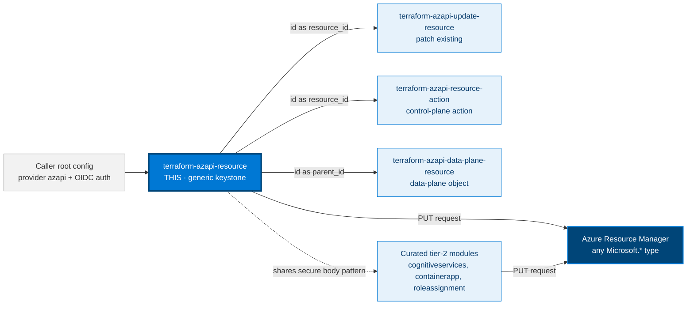
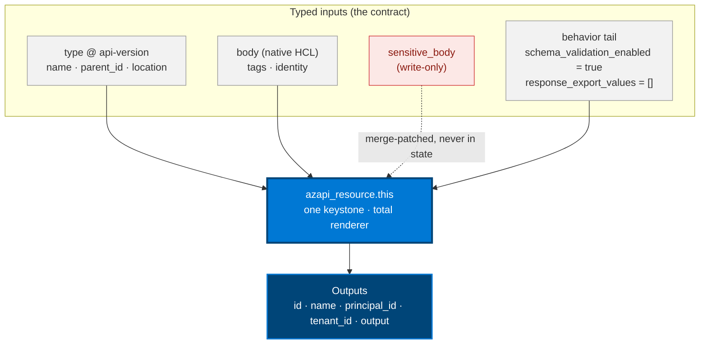

# 🧩 azapi **Resource** Terraform Module

> **One generic, secure-by-default boundary over the `azapi_resource` primitive** — manage *any* Azure
> Resource Manager resource type with a typed contract, write-only secrets, export-nothing defaults, and
> embedded schema validation on. The escape hatch for preview services, brand-new api-versions, and
> properties `azurerm` does not expose yet. Built for the Azure `azapi` provider **v2.x** (`~> 2.10`).


---

## 🧩 Overview

This module wraps the **`azapi_resource`** primitive — the one provider resource that can manage the full
lifecycle of *any* ARM type — behind the secure defaults:

- 🧬 **Type-is-the-contract** — caller-supplied ARM `type@api-version`, a native-HCL `body`, and a typed
 behavior tail. The empty call is the safe call.
- 🔐 **Write-only secrets** — credential material goes in `sensitive_body`, merge-patched at apply and
 **never persisted to state**.
- 🚫 **Export nothing by default** — `response_export_values = []`, so no read-only ARM property leaks
 into state or outputs unless you opt in per path.
- 🛡️ **Embedded validation on** — `schema_validation_enabled = true` catches malformed/unknown body keys
 at **plan**, before the request reaches Azure.
- 🆔 **Managed-identity first** — system- and/or user-assigned identity, with `principal_id` surfaced for
 RBAC; no embedded keys.
- 🎛️ **Full primitive surface** — `locks`, `retry`, `replace_triggers_*`, partial-list controls, and
 per-operation request headers/query parameters, all grouped and typed.

> 💡 **Why it matters:** raw `azapi_resource` is a loaded syringe — a dynamic `body`, secrets that can
> land in state, and read-backs that can leak. This module is the child-proof cap: it keeps the generic
> power while making the locked-down resource the *default*. When a curated `terraform-azapi-<service>_<resource>`
> module exists for your type, prefer it; reach for this generic wrapper when one does not exist yet.

> ⚠️ **This is the one module that accepts a caller-supplied `type`** (and therefore a caller-chosen
> api-version). Every *curated* module pins its type/api-version instead, per this module suite's design conventions. Do not copy
> this relaxation into a curated module.

---

## ❤️ Support this project

If these Terraform modules have been helpful to you or your organization, I'd appreciate your support in any of the following ways:

- ⭐ **Star this repository** to help others discover this Terraform module.
- 🤝 **Connect with me on LinkedIn:** [linkedin.com/in/microsoftexpert](https://www.linkedin.com/in/microsoftexpert)
- ☕ **Buy me a coffee:** [buymeacoffee.com/microsoftexpert](https://buymeacoffee.com/microsoftexpert)

Whether it's a star, a professional connection, or a coffee, every gesture helps keep these modules actively maintained and continually improving. Thank you for being part of the community!

---

## 📁 Module Structure

```
terraform-azapi-resource/
├── providers.tf # required_providers (Azure/azapi ~> 2.10) + required_version >= 1.12.0; no provider block
├── variables.tf # type, placement, body, sensitive_body, identity, behavior tail, tags, timeouts, request_options
├── main.tf # one keystone azapi_resource.this; total renderer; dynamic identity/timeouts
├── outputs.tf # id (primary), name, output (opt-in), principal_id, tenant_id
├── examples/
│ └── basic/ # minimal secure call (a resource group)
├── README.md # you are here
└── SCOPE.md # lightweight cross-module contract
```

---

## 🗺️ Where this fits in the family



> ℹ️ Blue = **this module**. Deep blue = **Azure Resource Manager**, the universal target. The other
> three primitives operate on resources this module (or `azurerm`) creates; curated tier-2 modules reuse
> the same secure-body pattern for specific ARM types.

---

## 🧬 What this module builds



**Resource inventory** (1 `azapi_*` block):

- **`azapi_resource.this`** — the single keystone. Renders `type` / `name` / `parent_id` / `location` /
 `body` from typed inputs; routes secrets through write-only `sensitive_body`; maps the behavior tail
 onto `schema_validation_enabled` / `ignore_*` / `response_export_values` / `locks` / `retry`; renders
 `identity` and `timeouts` as dynamic blocks.

---

## ✅ Provider / Versions

| Requirement | Value |
|---|---|
| Terraform | `>= 1.12.0` |
| azapi provider | `~> 2.10` (validated against **v2.10.0**) |
| Provider config | **None inside the module** — the caller configures `provider "azapi"` + auth. |

**Schema notes that bite** (verified against the azapi v2.10.0 binary schema):

- 🧱 `name`, `parent_id`, and the resource-type portion of `type` are **force-new** — changing any
 destroys and recreates the resource. Changing only the **api-version** usually does **not** replace
 (azapi's change detection treats a functionally-equivalent body as a no-op).
- 🔐 `sensitive_body` is a **write-only** argument (Terraform ≥ 1.11 feature) — its value is never
 written to state. Pair it with `sensitive_body_version` to force a re-send when a rotated secret
 changes.
- 🚫 `behavior.response_export_values = []` means the provider exports **nothing** into `output`. With
 the provider default `disable_default_output = false`, leaving the argument *unspecified* would pull
 read-only props into state — this module always sets it, so the secure behavior is the default.
- ♻️ `retry.multiplier` and `retry.randomization_factor` exist in the schema but are **deprecated**;
 this module intentionally does not expose them.

---

## 🔑 Required Azure RBAC Permissions

Because the ARM `type` is **caller-supplied**, exact permissions are type-dependent. For whatever type
is passed, the apply identity needs, on the target `parent_id` scope:

- `Microsoft.<RP>/<resource>/write`, `/read`, `/delete` — control-plane CRUD for that type.
- Any child-action the body triggers (e.g. `Microsoft.<RP>/<resource>/<action>/action`).
- **RP registration**: `Microsoft.<RP>` registered in the subscription (or
 `Microsoft.Resources/subscriptions/providers/register/action` if `skip_provider_registration = false`).
- **Least-privilege**: a custom role scoped to exactly the above, or a service-specific built-in role
 (e.g. *Storage Account Contributor*) on the `parent_id` scope — never subscription Owner.

> ⚠️ Final permission scoping is a control decision — route role design to Cloud Security / IAM before
> granting. This module assigns no roles itself.

---

## 🧰 Azure Prerequisites

- The resource provider `Microsoft.<RP>` for the chosen `type` is registered in the subscription
 (`az provider show -n Microsoft.<RP>`).
- The chosen `type` api-version is available in the target region (Microsoft Learn / `az provider show`).
- The `parent_id` scope already exists (resource group / parent resource / extension target).
- Terraform `>= 1.12`; azapi `~> 2.10`.
- Recommended provider posture (set by the **caller**, not this module): `enable_preflight = true`, and
 in regulated contexts `disable_default_output = true`.
- Auth configured by the caller — **OIDC / workload-identity federation preferred**.

---

## ⚙️ Quick Start

Smallest call that produces a real resource — a secure storage account:

```hcl
module "storage_account" {
  source = "git::https://github.com/microsoftexpert/terraform-azapi-resource?ref=v1.0.0"

  type      = "Microsoft.Storage/storageAccounts@2025-06-01"
  name      = "stcaseyexample001"
  parent_id = "/subscriptions/00000000-0000-0000-0000-000000000000/resourceGroups/rg-casey"
  location  = "eastus2"

  body = {
    sku  = { name = "Standard_LRS" }
    kind = "StorageV2"
    properties = {
      minimumTlsVersion        = "TLS1_2"
      allowBlobPublicAccess    = false
      allowSharedKeyAccess     = false
      publicNetworkAccess      = "Disabled"
      supportsHttpsTrafficOnly = true
    }
  }

  tags = { environment = "prod", owner = "platform" }
}

# The CALLER configures the provider + auth (this module does not):
provider "azapi" {
  enable_preflight       = true
  disable_default_output = true
}
```

> ⚠️ Pin the module by **tag** (`?ref=v1.0.0`), never a branch. Tags are immutable once consumers
> reference them; a branch can change under you.

---

## 🔌 Cross-Module Contract

### Consumes

| Input | Type | Source |
|---|---|---|
| `parent_id` | `string` (scope ARM ID) | an RG / parent-resource module, or `provider::azapi::resource_group_resource_id(...)` |
| `identity.identity_ids` | `list(string)` | a user-assigned managed identity module |
| `body.properties.encryption…` (CMK) | `string` (Key Vault key URI) | a Key Vault module |

### Emits

| Output | Description | Consumed by |
|---|---|---|
| `id` | ARM resource ID of the managed resource | role assignments, private endpoints, diagnostics, child `parent_id` |
| `name` | Resource name (may be provider-computed) | data-plane config, app settings |
| `principal_id` | System-assigned identity principal (`null` if none) | role assignments for the resource's MI |
| `tenant_id` | System-assigned identity tenant (`null` if none) | cross-tenant scenarios |
| `output` | Opt-in read-back of `behavior.response_export_values` (`{}` by default) | downstream config referencing computed props |

---

## 📚 Example Library

<details>
<summary><strong>1 · Minimal — a resource group</strong></summary>

```hcl
module "resource_group" {
  source = "git::https://github.com/microsoftexpert/terraform-azapi-resource?ref=v1.0.0"

  type      = "Microsoft.Resources/resourceGroups@2024-11-01"
  name      = "rg-casey-example"
  parent_id = "/subscriptions/00000000-0000-0000-0000-000000000000"
  location  = "eastus2"

  tags = { environment = "example", managed_by = "terraform" }
}
```

> ℹ️ For `Microsoft.Resources/resourceGroups`, `parent_id` is the **subscription** ID. It may even be
> omitted — it then defaults to the provider's subscription.
</details>

<details>
<summary><strong>2 · Secure storage account (the hardened default body)</strong></summary>

```hcl
module "storage" {
  source = "git::https://github.com/microsoftexpert/terraform-azapi-resource?ref=v1.0.0"

  type      = "Microsoft.Storage/storageAccounts@2025-06-01"
  name      = "stcaseydata001"
  parent_id = module.resource_group.id
  location  = "eastus2"

  body = {
    sku  = { name = "Standard_LRS" }
    kind = "StorageV2"
    properties = {
      minimumTlsVersion        = "TLS1_2" # never below
      supportsHttpsTrafficOnly = true
      allowBlobPublicAccess    = false      # no anonymous blobs
      allowSharedKeyAccess     = false      # Entra-only auth
      publicNetworkAccess      = "Disabled" # private endpoints only
      networkAcls              = { defaultAction = "Deny" }
    }
  }
}
```

> 🔒 This is the baseline: TLS 1.2, HTTPS-only, no public/anonymous access, shared-key auth off,
> network default-deny. Open each up deliberately, one property at a time.
</details>

<details>
<summary><strong>3 · Key Vault — RBAC, purge protection, network deny</strong></summary>

```hcl
module "key_vault" {
  source = "git::https://github.com/microsoftexpert/terraform-azapi-resource?ref=v1.0.0"

  type      = "Microsoft.KeyVault/vaults@2024-11-01"
  name      = "kv-casey-prod"
  parent_id = module.resource_group.id
  location  = "eastus2"

  body = {
    properties = {
      tenantId                = "72f988bf-0000-0000-0000-2d7cd011db47"
      sku                     = { family = "A", name = "standard" }
      enableRbacAuthorization = true # RBAC, not access policies
      enableSoftDelete        = true
      enablePurgeProtection   = true
      publicNetworkAccess     = "Disabled"
      networkAcls             = { defaultAction = "Deny", bypass = "AzureServices" }
    }
  }
}
```
</details>

<details>
<summary><strong>4 · System-assigned identity → feed principal_id into RBAC</strong></summary>

```hcl
module "app" {
  source = "git::https://github.com/microsoftexpert/terraform-azapi-resource?ref=v1.0.0"

  type      = "Microsoft.Web/sites@2024-04-01"
  name      = "app-casey-orders"
  parent_id = module.resource_group.id
  location  = "eastus2"

  identity = { type = "SystemAssigned" }

  body = {
    properties = { httpsOnly = true }
  }
}

# principal_id is NOT sensitive — RBAC needs a plain value.
module "kv_reader" {
  source       = "git::https://github.com/microsoftexpert/terraform-azapi-authorization-roleassignment?ref=v1.0.0"
  scope        = module.key_vault.id
  role         = "Key Vault Secrets User"
  principal_id = module.app.principal_id
}
```
</details>

<details>
<summary><strong>5 · User-assigned identity</strong></summary>

```hcl
module "app" {
  source = "git::https://github.com/microsoftexpert/terraform-azapi-resource?ref=v1.0.0"

  type      = "Microsoft.Web/sites@2024-04-01"
  name      = "app-casey-uami"
  parent_id = module.resource_group.id
  location  = "eastus2"

  identity = {
    type         = "UserAssigned"
    identity_ids = [module.uami.id] # from a user-assigned identity module
  }

  body = { properties = { httpsOnly = true } }
}
```

> ℹ️ `identity.type` is validated: `SystemAssigned` | `UserAssigned` | `SystemAssigned, UserAssigned` |
> `None`. `identity_ids` is required when the type includes `UserAssigned`.
</details>

<details>
<summary><strong>6 · Write-only secret via <code>sensitive_body</code></strong></summary>

```hcl
module "sql_server" {
  source = "git::https://github.com/microsoftexpert/terraform-azapi-resource?ref=v1.0.0"

  type      = "Microsoft.Sql/servers@2023-08-01-preview"
  name      = "sql-casey-prod"
  parent_id = module.resource_group.id
  location  = "eastus2"

  body = {
    properties = {
      administratorLogin  = "caseyadmin"
      minimalTlsVersion   = "1.2"
      publicNetworkAccess = "Disabled"
    }
  }

  # The password is write-only — merge-patched at apply, NEVER stored in state.
  sensitive_body = {
    properties = {
      administratorLoginPassword = var.sql_admin_password # mark this variable sensitive in the caller
    }
  }
}
```

> 🔒 Secrets go in `sensitive_body`, never in `body`. With `ignore_missing_property = true` (the
> default), the un-echoed password does not show as drift.
</details>

<details>
<summary><strong>7 · Read back a non-secret value via <code>response_export_values</code></strong></summary>

```hcl
module "storage" {
  source = "git::https://github.com/microsoftexpert/terraform-azapi-resource?ref=v1.0.0"

  type      = "Microsoft.Storage/storageAccounts@2025-06-01"
  name      = "stcaseyexport001"
  parent_id = module.resource_group.id
  location  = "eastus2"
  body      = { sku = { name = "Standard_LRS" }, kind = "StorageV2" }

  behavior = {
    # JMESPath map — export ONLY non-secret read-only props.
    response_export_values = {
      blob_endpoint = "properties.primaryEndpoints.blob"
    }
  }
}

output "blob_endpoint" {
  value = module.storage.output.blob_endpoint
}
```

> ⚠️ Never export a secret path here — `output` lands in state. `azapi_resource` has no sensitive
> read-back channel; for secret results use `terraform-azapi-resource-action`.
</details>

<details>
<summary><strong>8 · Serialize risky ops with <code>behavior.locks</code></strong></summary>

```hcl
module "subnet" {
  source = "git::https://github.com/microsoftexpert/terraform-azapi-resource?ref=v1.0.0"

  type      = "Microsoft.Network/virtualNetworks/subnets@2024-05-01"
  name      = "snet-apps"
  parent_id = module.vnet.id
  body      = { properties = { addressPrefix = "10.10.1.0/24" } }

  behavior = {
    # Avoid parallel subnet writes racing on the same vnet.
    locks = [module.vnet.id]
  }
}
```
</details>

<details>
<summary><strong>9 · Transient-error retry policy</strong></summary>

```hcl
module "resource" {
  source = "git::https://github.com/microsoftexpert/terraform-azapi-resource?ref=v1.0.0"

  type      = "Microsoft.OperationalInsights/workspaces@2023-09-01"
  name      = "law-casey"
  parent_id = module.resource_group.id
  location  = "eastus2"
  body      = { properties = { sku = { name = "PerGB2018" } } }

  behavior = {
    retry = {
      error_message_regex  = ["ResourceGroupBeingDeleted", "TooManyRequests"]
      interval_seconds     = 10  # 1..120
      max_interval_seconds = 120 # 1..300
    }
  }
}
```
</details>

<details>
<summary><strong>10 · Force replacement with <code>replace_triggers_external_values</code></strong></summary>

```hcl
module "vm" {
  source = "git::https://github.com/microsoftexpert/terraform-azapi-resource?ref=v1.0.0"

  type      = "Microsoft.Compute/virtualMachines@2024-07-01"
  name      = "vm-casey"
  parent_id = module.resource_group.id
  location  = "eastus2"
  body      = { properties = { hardwareProfile = { vmSize = var.vm_size } } }

  # Replace the VM when the SKU changes (ARM treats vmSize as updatable, but you want a clean rebuild).
  replace_triggers_external_values = [var.vm_size]
}
```

> ℹ️ Set `replace_triggers_external_values = null` ("break glass") to disable the trigger.
</details>

<details>
<summary><strong>11 · Subscription-scope resource (a budget)</strong></summary>

```hcl
module "budget" {
  source = "git::https://github.com/microsoftexpert/terraform-azapi-resource?ref=v1.0.0"

  type      = "Microsoft.Consumption/budgets@2023-11-01"
  name      = "budget-casey-monthly"
  parent_id = "/subscriptions/00000000-0000-0000-0000-000000000000" # subscription scope

  body = {
    properties = {
      category   = "Cost"
      amount     = 5000
      timeGrain  = "Monthly"
      timePeriod = { startDate = "2026-07-01T00:00:00Z" }
    }
  }
}
```

> ℹ️ The deployment scope is the `parent_id`: a subscription ID here, an RG ID elsewhere.
</details>

<details>
<summary><strong>12 · Management-group-scope resource (a policy assignment)</strong></summary>

```hcl
module "mg_policy" {
  source = "git::https://github.com/microsoftexpert/terraform-azapi-resource?ref=v1.0.0"

  type      = "Microsoft.Authorization/policyAssignments@2024-04-01"
  name      = "require-tls12"
  parent_id = "/providers/Microsoft.Management/managementGroups/casey-root" # MG scope

  body = {
    properties = {
      displayName        = "Require TLS 1.2 on storage"
      policyDefinitionId = "/providers/Microsoft.Authorization/policyDefinitions/404c3081-a854-4457-ae30-26a93ef643f9"
      enforcementMode    = "Default"
    }
  }
}
```
</details>

<details>
<summary><strong>13 · Extension-scope resource (a resource lock)</strong></summary>

```hcl
module "delete_lock" {
  source = "git::https://github.com/microsoftexpert/terraform-azapi-resource?ref=v1.0.0"

  type      = "Microsoft.Authorization/locks@2020-05-01"
  name      = "no-delete"
  parent_id = module.key_vault.id # EXTENSION scope: the resource being protected

  body = {
    properties = {
      level = "CanNotDelete"
      notes = "Prod Key Vault — deletion blocked by policy."
    }
  }
}
```

> ℹ️ For an **extension** resource, `parent_id` is the ID of the resource being extended.
</details>

<details>
<summary><strong>14 · <code>for_each</code> at scale — many resources from a map</strong></summary>

```hcl
locals {
  accounts = {
    "stcaseyapp001"  = "eastus2"
    "stcaseyapp002"  = "westus2"
    "stcaseylogs001" = "eastus2"
  }
}

module "storage" {
  source   = "git::https://github.com/microsoftexpert/terraform-azapi-resource?ref=v1.0.0"
  for_each = local.accounts

  type      = "Microsoft.Storage/storageAccounts@2025-06-01"
  name      = each.key
  parent_id = module.resource_group.id
  location  = each.value

  body = {
    sku  = { name = "Standard_LRS" }
    kind = "StorageV2"
    properties = {
      minimumTlsVersion   = "TLS1_2"
      publicNetworkAccess = "Disabled"
    }
  }
}
```

> 💡 `for_each` is applied by the **caller** on the module call — the module itself stays a single
> keystone. Map keys are the stable instance identity.
</details>

<details>
<summary><strong>15 · 🏗️ End-to-end composition (mandatory) — RG → storage → role assignment</strong></summary>

```hcl
# 1) Resource group (this module, subscription scope)
module "resource_group" {
  source    = "git::https://github.com/microsoftexpert/terraform-azapi-resource?ref=v1.0.0"
  type      = "Microsoft.Resources/resourceGroups@2024-11-01"
  name      = "rg-casey-orders"
  parent_id = "/subscriptions/00000000-0000-0000-0000-000000000000"
  location  = "eastus2"
}

# 2) Secure storage account with a system identity (this module, RG scope)
module "storage" {
  source    = "git::https://github.com/microsoftexpert/terraform-azapi-resource?ref=v1.0.0"
  type      = "Microsoft.Storage/storageAccounts@2025-06-01"
  name      = "stcaseyorders001"
  parent_id = module.resource_group.id # ← wired from output
  location  = module.resource_group.location
  identity  = { type = "SystemAssigned" }

  body = {
    sku  = { name = "Standard_LRS" }
    kind = "StorageV2"
    properties = {
      minimumTlsVersion    = "TLS1_2"
      allowSharedKeyAccess = false
      publicNetworkAccess  = "Disabled"
    }
  }
}

# 3) Grant the storage identity a role on the vault (principal_id wired from output)
module "kv_secrets_user" {
  source       = "git::https://github.com/microsoftexpert/terraform-azapi-authorization-roleassignment?ref=v1.0.0"
  scope        = module.key_vault.id
  role         = "Key Vault Secrets User"
  principal_id = module.storage.principal_id # ← wired from output (not sensitive)
}
```

> 🏗️ This is the contract in action: `id` becomes the next resource's `parent_id`, and `principal_id`
> becomes an RBAC principal. Outputs → inputs, in dependency order.
</details>

---

## 📥 Inputs

**Core** — `type` (required), `name`, `parent_id`, `location`.
**Body** — `body` (native HCL), `sensitive_body` (write-only secrets), `sensitive_body_version`.
**Identity & metadata** — `identity`, `tags`.
**Behavior tail** — `behavior` (validation/casing/missing/null/export/locks/list-controls/retry), `timeouts`.
**Lifecycle / advanced** — `replace_triggers_external_values`, `replace_triggers_refs`, `request_options`.

<details>
<summary><strong>Full <code>object</code> schemas</strong></summary>

```hcl
type = string # "<Namespace>/<resource>@<api-version>"; validated ^.+/.+@.+$; resource-type portion force-new
name = optional(string) # force-new
parent_id = optional(string) # deployment scope (RG/sub/MG/tenant/extension/parent); force-new
location = optional(string)
body = optional(any, {}) # native HCL; camelCase ARM keys; NO secrets here
sensitive_body = optional(any) # sensitive = true; write-only; secrets only
sensitive_body_version = optional(map(string), {})

identity = optional(object({
 type = string # SystemAssigned | UserAssigned | "SystemAssigned, UserAssigned" | None
 identity_ids = optional(list(string)) # required when type includes UserAssigned
})) # default null

behavior = optional(object({
 schema_validation_enabled = optional(bool, true) # keep true
 ignore_casing = optional(bool, false)
 ignore_missing_property = optional(bool, true) # provider default
 ignore_null_property = optional(bool, false)
 response_export_values = optional(any, []) # export NOTHING by default
 locks = optional(list(string), [])
 ignore_other_items_in_list = optional(list(string), [])
 list_unique_id_property = optional(map(string), {})
 retry = optional(object({
 error_message_regex = list(string)
 interval_seconds = optional(number, 10) # 1..120
 max_interval_seconds = optional(number, 180) # 1..300
 }))
}), {})

tags = optional(map(string), {}) # max 50
timeouts = optional(object({ create, read, update, delete = optional(string) })) # default null
replace_triggers_external_values = optional(any) # default null
replace_triggers_refs = optional(list(string), [])
request_options = optional(object({ # advanced per-operation headers/query params
 create_headers/read_headers/update_headers/delete_headers = optional(map(string), {})
 create_query_parameters/.../delete_query_parameters = optional(map(list(string)), {})
}), {})
```

> ℹ️ `body` is typed `any` **only** because this is the generic wrapper (the documented exception). A
> curated tier-2 module mirrors the body in a deeply-typed `object`.
</details>

---

## 🧾 Outputs

| Output | Description | Sensitive |
|---|---|---|
| `id` | **Primary.** ARM resource ID of the managed resource. | no |
| `name` | Resource name (may be provider-computed). | no |
| `output` | Opt-in read-back of `behavior.response_export_values` (`{}` by default). | no — but may carry exported values; never export secret paths |
| `principal_id` | System-assigned identity principal (`null` if none). | no |
| `tenant_id` | System-assigned identity tenant (`null` if none). | no |

---

## 🧠 Architecture Notes

**The generic-`type` exception, and when not to use it.** This is the only azapi module that accepts
a caller-supplied `type`/api-version. That power is also its risk: there is no curated, deeply-typed
`body` contract for a specific resource. Prefer a curated `terraform-azapi-<service>_<resource>` when one
exists; reach for this wrapper for preview services, a newer api-version than `azurerm` exposes, or a
property `azurerm` does not surface. When you author a curated module, **pin** the type/api-version and
mirror the body in a typed `object` — do not copy the `body = any` relaxation.

**Secrets stay out of state via `sensitive_body`.** `body` and `sensitive_body` are merged into one
request at apply, but `sensitive_body` is a *write-only* argument — Terraform never persists it. Pair it
with `sensitive_body_version` (a `{ path → version }` map) to re-send a rotated secret on demand, and
leave `ignore_missing_property = true` so the un-echoed value does not register as drift. Never place a
secret in `body`, an `output`, or an example.

**Export control is the leak boundary.** `behavior.response_export_values` defaults to `[]`, so `output`
is an empty object and nothing read-only is pulled into state. Opt in per JMESPath path/map, and only for
**non-secret** values — `azapi_resource` has no sensitive read-back channel (that is what
`terraform-azapi-resource-action` + `sensitive_response_export_values` is for). In regulated contexts also set
`disable_default_output = true` on the provider as belt-and-suspenders.

**`parent_id` is the deployment scope.** Top-level resources take a scope ID (RG / subscription /
management group / tenant); a child resource takes its parent's ID; an extension resource takes the ID of
the resource it extends. Build it with the provider functions
(`provider::azapi::resource_group_resource_id`, `subscription_resource_id`, …) where it improves clarity.

**Total renderer.** `main.tf` is a pure projection of typed input onto the one `azapi_resource.this` —
`dynamic` for `identity`/`timeouts`, a null-guarded conditional for `retry`, and direct passthrough for
the behavior controls. An unset optional simply omits the argument; no null guard ever leaks to the
caller.

---

## 🧱 Design Principles

> The empty call is the safe call.

| Concern | Secure default | Opt-out |
|---|---|---|
| Embedded validation | `behavior.schema_validation_enabled = true` | set `false` (justify; only for an api-version the embedded schema lags) |
| Secrets | routed via `sensitive_body` (write-only, never in state) | — (placing secrets in `body` is forbidden) |
| Missing-property drift | `behavior.ignore_missing_property = true` | set `false` |
| Output exposure | `behavior.response_export_values = []` (export nothing) | pass explicit paths / a JMESPath map |
| Casing drift | `behavior.ignore_casing = false` | set `true` |
| Concurrency | `behavior.locks = []` available | populate with ARM IDs |
| Identity | managed identity via `identity` (no embedded keys) | — |
| Body shape | native HCL `body` (never `jsonencode`) | — |

> **Documented generic-wrapper exceptions:** `type`/api-version are caller-supplied, and `body` is typed
> `any`. Both are intentional for this module only — never replicate them in a curated tier-2 module.

---

## 🚀 Runbook

Authoring is **plan-only** (regulated-FI / PII / privacy-regulation posture) — a human applies from a controlled CI
context:

```bash
cd terraform-azapi-resource
terraform init -backend=false # downloads azapi ~> 2.10 only; no remote state
terraform validate # type-checks variables.tf + main.tf
terraform fmt -check -recursive # style gate
# NO `terraform apply` here. plan/apply against an environment is a separate, human-reviewed CI step.
rm -rf.terraform.terraform.lock.hcl
```

> ⚠️ Consume the module pinned to a tag — `?ref=v1.0.0`, never a branch.

---

## 🧪 Testing

Offline proof gate (no cloud credentials required):

```bash
terraform init -backend=false # azapi ~> 2.10 only
terraform validate # "Success! The configuration is valid."
terraform fmt -check -recursive # zero formatting differences
```

> ℹ️ `terraform validate` runs fully offline. Because `body` is `Dynamic`, much of the safety comes from
> the typed `variables.tf` and the provider's embedded `schema_validation_enabled` — the latter only
> evaluates the body fully at **plan** against a real api-version.

---

## 💬 Example Output

```hcl
id           = "/subscriptions/.../resourceGroups/rg-casey/providers/Microsoft.Storage/storageAccounts/stcaseydata001"
name         = "stcaseydata001"
principal_id = "00000000-0000-0000-0000-000000000000" # system identity, when enabled
output       = {}                                     # nothing exported by default
```

---

## 🔍 Troubleshooting

| Symptom | Cause | Fix |
|---|---|---|
| `Body key rejected at plan` | `schema_validation_enabled` caught an unknown/malformed key for your api-version | Fix the key (camelCase, correct nesting). Don't reflexively disable validation. |
| A secret/PII value landed in state or an output | You exported it via `behavior.response_export_values` | Set it back to `[]`; for secret read-backs use `terraform-azapi-resource-action` + `sensitive_response_export_values` |
| Secret shows as drift | Secret placed in `body`, or `ignore_missing_property = false` | Move it to `sensitive_body`; keep `ignore_missing_property = true` |
| Wrong scope / `parent_id` | Top-level takes a scope ID; child takes the parent's ID; extension takes the target's ID | Build it with the provider functions |
| Re-apply wants to replace the resource | You changed `name`, `parent_id`, or the resource-type portion of `type` (all force-new) | Expected. Changing only the api-version usually does not replace. |
| `type must be in the form...` | `type` failed the `^.+/.+@.+$` validation | Use `Microsoft.X/y@YYYY-MM-DD` |

---

## 🔗 Related Docs

- Terraform azapi provider — [`azapi_resource`](https://registry.terraform.io/providers/Azure/azapi/latest/docs/resources/resource) resource reference
- Azure Resource Manager template reference — `learn.microsoft.com/azure/templates/<RP>/<resource>` for the type you target
- azapi provider functions — `resource_group_resource_id`, `subscription_resource_id`, `build_resource_id`, …
- Sibling modules — `terraform-azapi-update-resource`, `terraform-azapi-resource-action`, `terraform-azapi-data-plane-resource`
- `SCOPE.md` (this module) — the authoritative cross-module contract

---

> 💙 *"Infrastructure as Code should be standardized, consistent, and secure."*
